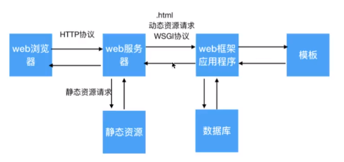

# Web Framework:

## Framework Flow


## router
use decorator to manage/add router

```python
def route(path):
    def decorator(func):
        route_list.append((path, func))
        def inner():
            result = func()
            return result
        return inner
    return decorator
```